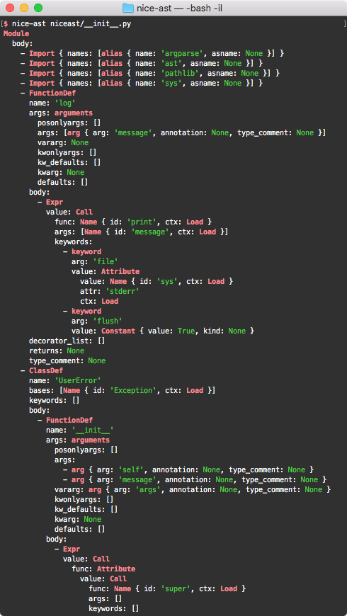

# nice-ast

`nice-ast` is a command line tool to dump a Python AST in a nicely formatted way.


## Usage

```
$ nice-ast --help
usage: nice-ast [-h] [-l LINE_COMPLEXITY] path

Parse a Python file and print the resulting AST in a nice, colorful way.

positional arguments:
  path                  Path to the Python file to parse.

optional arguments:
  -h, --help            show this help message and exit
  -l LINE_COMPLEXITY, --line-complexity LINE_COMPLEXITY
                        Maximum complexity of a node formatted on a single
                        line. Each node name, field name, and field value or
                        list item is counted as one. Defaults to 7.
```


## Screen Shot




## Resources

- [Python: ast — Abstract Syntax Trees](https://docs.python.org/3/library/ast.html)
- [Green Tree Snakes - the missing Python AST docs](https://greentreesnakes.readthedocs.io/)


## Development Setup

```
python3 -m venv venv
. venv/bin/activate
pip install -e '.[dev]'
```
